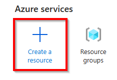
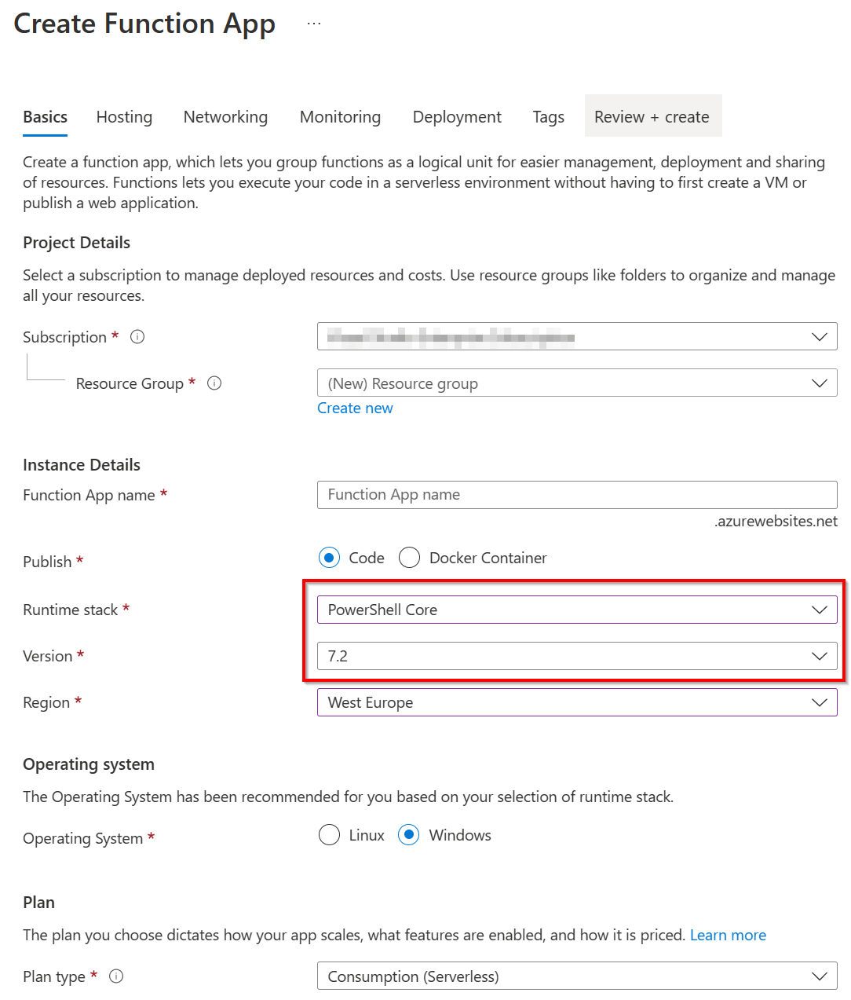
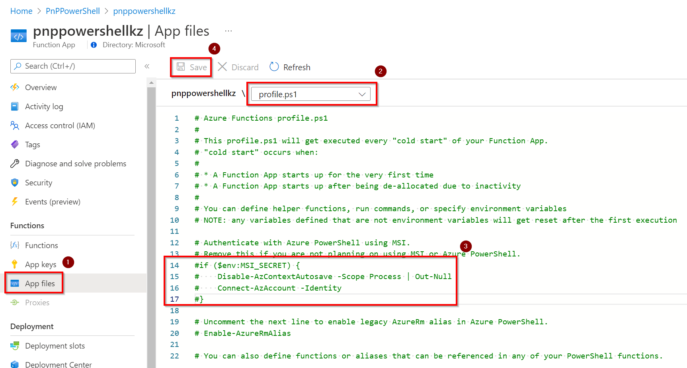
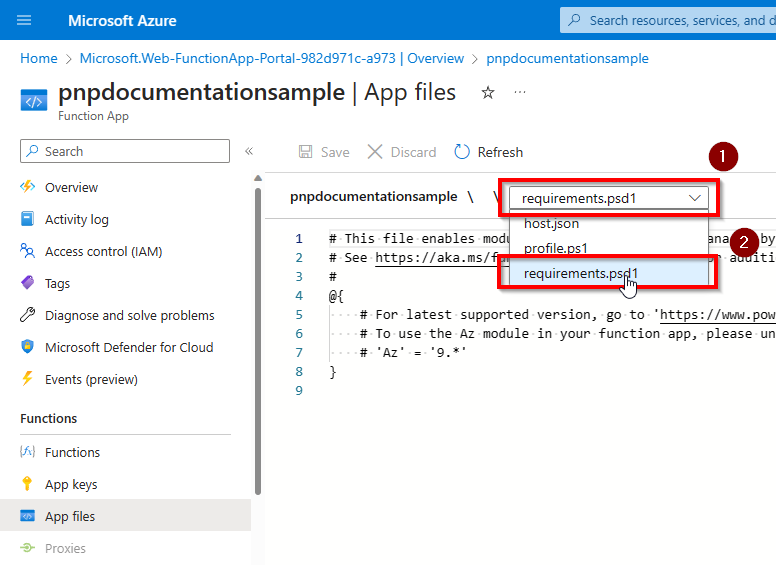
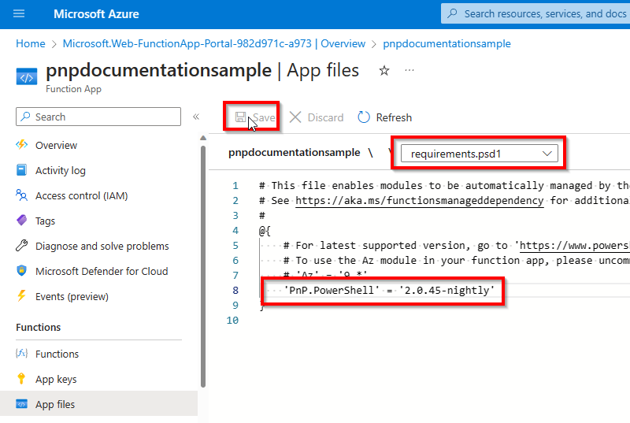

# Using PnP PowerShell in Azure Functions

In this article we will setup an Azure Function to use PnP PowerShell

> [!Important]
> Notice that the Azure Function scripts in this article run in a separate thread/job. We do this because of possible conflicts between assemblies of already loaded PowerShell modules and PnP PowerShell (for instance, the Az cmdlets that get loaded by default use some of the same assemblies as PnP PowerShell but in different versions which can cause conflicts). By running the script in a separate thread we will not have these conflicts. If PnP PowerShell is the only module currently being used and loaded in your Azure Function you don't need the Start-ThreadJob construct and you can simply write the script as usual.

## Create the Azure Function App

As the UI in [the Azure Portal](https://portal.azure.com) changes every now and then, but the principles stay the same, follow the following steps:

1. Go to the [Azure Portal](https://portal.azure.com) and login with your Azure credentials

1. Create a new Function App using the **Create a resource** button and searching for **Function App** or use this [direct link](https://portal.azure.com/#create/Microsoft.FunctionApp) to locate it
   
   

   

1. Choose runtime stack `PowerShell Core` and version `7.2` (7.0 is not longer an option as of December 3rd, 2022)

   

1. Select `Windows` as the operating system or else you will not be able to perform the following steps from your browser.

   

1. Complete the creation of the Azure Functon

1. Once the resource has been created, click on **Go to resource** to open the Azure Function

   

## Configure the Azure Function

Now your Azure Function has been created, proceed with the next paragraphs to configure it for using PnP PowerShell.

### Disable the Azure cmdlets in the Azure Function

The Azure Function comes with the Azure cmdlets pre-installed. If you don't need them, you can disable them to save some memory and processing time. It will also avoid version conflicts with PnP PowerShell, so it is highly recommended to disable them.

1. Navigate to `App files` which is located the left side menu of the function app under the `Functions` header.
   
   

1. To disable the Az cmdlets, save and edit the `profile.psd` file. Mark out the following block in the file as follows, if not already done:

   ```powershell
   # if ($env:MSI_SECRET) {
   #     Disable-AzContextAutosave -Scope Process | Out-Null     
   #     Connect-AzAccount -Identity
   # }
   ```

   Save the `profile.ps1` file. If you don't do this and enable a managed identity on the Azure Function, it will throw an exception.

   

### Make PnP PowerShell available to all functions in the Azure function App

1. Navigate to `App files` which is located the left side menu of the function app under the `Functions` header.
   
   

1. In the dropdown presented near the top, select `requirements.psd1`. You'll notice that the function app wants to provide the Azure cmdlets. If you do not need those, keep the `Az` entry presented commented out.

   

1. Add a new entry or replace the whole contents of the file with one of the following and remember to save the `requirements.psd1` file:

#### Specific stable version

   > [!Important]
   > There's currently no stable PnP PowerShell version that works with Azure Functions. Use the [latest nightly build](#specific-prerelease-version) instead.

   ```powershell
   @{
       'PnP.PowerShell' = '1.12.0'
   }
   ```

   The version that will be installed will be the specified specific build, which is generally recommended. You build and test your Azure Function against this specific PnP PowerShell version. Future releases may work differently and cause issues, therefore it is generally recommended to specify a specific version here.

#### Latest stable version

   > [!Important]
   > There's currently no stable PnP PowerShell version that works with Azure Functions. Use the [latest nightly build](#specific-prerelease-version) instead.   

   If, for some reason, you would like to ensure it is always using the latest available PnP PowerShell version, you can also specify a wildcard in the version (not recommended):

   ```powershell
   @{
       'PnP.PowerShell' = '1.*'
    }
   ```

   This will then automatically download any minor version of the major 1 release when available. Note that wildcards will always take the latest stable version and not the nightly build/prerelease versions.

#### Specific prerelease version

   If you wish to use a specific prerelease/nightly build version, go to the [overview of available versions](https://www.powershellgallery.com/packages/PnP.PowerShell) and literally copy/paste the version in the definition, i.e.:  

   ```powershell
   @{
       'PnP.PowerShell' = '2.0.45-nightly'
    }
   ```   

   

## Decide how you want to authenticate in your Azure Function

### By using a Managed Identity

The recommended option is to use a [managed identity in Azure](https://learn.microsoft.com/azure/active-directory/managed-identities-azure-resources/overview) to allow your Azure Function to connect to Microsoft Graph or SharePoint Online using PnP PowerShell. Using this method, you specifically grant permissions for your Azure Function or Runbook to access these permissions, without having any client secret or certificate pair that potentially could fall into wrong hands. This makes this option the most secure option by far. Since version 1.11.95-nightly, Managed Identities are both supported against SharePoint Online as well as Microsoft Graph cmdlets. Before this version, only Microsoft Graph was being supported.

#### Enabling the managed identity for an Azure Function

1. In your Azure Function, in the left menu, go to Identity

1. Ensure you are on the System assigned tab and flip the switch for Status to On

1. Click the save button and confirm your action in the dialog box that will be shown

A new entry will now automatically be created in your Azure Active Directory for this app having the same name as your Azure Function and the Object (principal) ID shown on this page. Take notice of the Object (principal) ID. We will need it in the next section to assign permissions to.

#### Assigning permissions to the managed identity

Next step is to assign permissions to this managed identity so it is authorized to access the Microsoft Graph and/or SharePoint Online.

1. If you don't know which permissions exist yet, you can use the below sample to get a list of all available permissions:

    ```powershell
    Get-PnPAzureADServicePrincipal -BuiltInType MicrosoftGraph | Get-PnPAzureADServicePrincipalAvailableAppRole
    Get-PnPAzureADServicePrincipal -BuiltInType SharePointOnline | Get-PnPAzureADServicePrincipalAvailableAppRole
    ```

1. Once you know which permissions you would like to assign, you can use the below samples. Note that the Principal requires the object Id (not the application/client id) or the application name.

   ```powershell
   Add-PnPAzureADServicePrincipalAppRole -Principal "62614f96-cb78-4534-bf12-1f6693e8237c" -AppRole "Group.Read.All" -BuiltInType MicrosoftGraph
   Add-PnPAzureADServicePrincipalAppRole -Principal "mymanagedidentity" -AppRole "Sites.FullControl.All" -BuiltInType SharePointOnline
   ```

#### Create the Azure Function for managed identity authentication

Create a new function and replace the function code with the following example:

```powershell
using namespace System.Net

param($Request, $TriggerMetadata)

Connect-PnPOnline tenant.sharepoint.com -ManagedIdentity
Get-PnPMicrosoft365Group

Push-OutputBinding -Name Response -Value ([HttpResponseContext]@{
    StatusCode = [HttpStatusCode]::OK
})

```

Notice the super clean and simple `Connect-PnPOnline`. Nothing that could fall into wrong hands, no client secret or certificate that could expire. Based on the permissions assigned to the managed identity, it will be able to authenticate and authorize access to the Microsoft Graph APIs used behind the cmdlet to fetch the data.

### By using a certificate

#### Create your certificate

In this following example we create a new Azure AD Application registration which creates your certificates. You can also use a private/public certificate key pair you already have.

```powershell
$password = Read-Host -Prompt "Enter certificate password" -AsSecureString
Register-PnPAzureADApp -ApplicationName "MyDemoApp" -Tenant [yourtenant.onmicrosoft.com] -CertificatePassword $password -Interactive
```

You will be asked to authenticate. Log in using an account that has the permissions to create an app registration in your Azure Active Directory. After logging in, the following actions will automatically be taken:

- An app registration will be created using the provided name
- A self signed certificate will be generated which includes a pfx and a cer file (private/public key pair)
- The public key of the certificate (cer) will be configured as a valid certificate to authenticate with for the app registration
- A basic set of permissions will be assigned to the app registration. These can freely be changed at will at a later time.
- Admin consent will be given to the given set of permissions

Make a note of the clientid shown and proceed with the steps in the following section.

#### Apply your certificate

Once you have an Azure Active Directory application set up and the public key certificate uploaded to its registration, proceed with configuring the Azure Function to make use of the private key of this certificate pair:

1. In your function app, navigate to `TLS/SSL Settings` and switch to the `Private Key Certificates (.pfx)` section.
2. Click `Upload Certificate` and select the "MyDemoApp.pfx" file that has been created for you. Enter the password you used in the script above.
3. After the certificate has been uploaded, copy the thumbprint value shown.
4. Navigate to `Configuration` and add a new Application Setting
5. Call the setting `WEBSITE_LOAD_CERTIFICATES` and set the thumbprint as a value. To make all the certificates you uploaded available use `*` as the value. See <https://learn.microsoft.com/azure/app-service/configure-ssl-certificate-in-code> for more information.
6. Save the settings

#### Create the Azure Function for certificate authentication

Create a new function and replace the function code with the following example:

```powershell
using namespace System.Net

# Input bindings are passed in via param block.
param($Request, $TriggerMetadata)

# Write to the Azure Functions log stream.
Write-Host "PowerShell HTTP trigger function processed a request."

$script = {
    Connect-PnPOnline -Url https://tenant.sharepoint.com/sites/demo -ClientId [the clientid created earlier] -Thumbprint [the thumbprint you copied] -Tenant [tenant.onmicrosoft.com]

    $web = Get-PnPWeb;
    $web.Title
}

$webTitle = Start-ThreadJob -Script $script | Receive-Job -Wait

$body = "The title of the web is $($webTitle)"

# Associate values to output bindings by calling 'Push-OutputBinding'.
Push-OutputBinding -Name Response -Value ([HttpResponseContext]@{
        StatusCode = [HttpStatusCode]::OK
        Body = $body
    })
```

### By using Credentials

This method is not recommended as it requires you to have an account without MFA of which its credentials will be stored in Azure.

#### Create your credentials

1. Navigate to `Configuration` under `Settings` and create a new Application Setting.
2. Enter `tenant_user` and enter the username you want to authenticate with as the user
3. Enter `tenant_pwd` and enter the password you want to use for that user

#### Create the function

Create a new function and replace the function code with following example:

````powershell
using namespace System.Net

# Input bindings are passed in via param block.
param($Request, $TriggerMetadata)

# Write to the Azure Functions log stream.
Write-Host "PowerShell HTTP trigger function processed a request."

$script = {
    $securePassword = ConvertTo-SecureString $env:tenant_pwd -AsPlainText -Force
    $credentials = New-Object PSCredential ($env:tenant_user, $securePassword)

    Connect-PnPOnline -Url https://yourtenant.sharepoint.com/sites/demo -Credentials $credentials

    $web = Get-PnPWeb;
    $web.Title
}

$webTitle = Start-ThreadJob -Script $script | Receive-Job -Wait

$body = "The title of the web is $($webTitle)"

# Associate values to output bindings by calling 'Push-OutputBinding'.
Push-OutputBinding -Name Response -Value ([HttpResponseContext]@{
        StatusCode = [HttpStatusCode]::OK
        Body = $body
    })
````

In the example above we are retrieving the username and password from the settings as environment variables. We then create a new credentials object which we pass in to the `Connect-PnPOnline` cmdlet. After connecting to SharePoint we output the title of the web through the function.